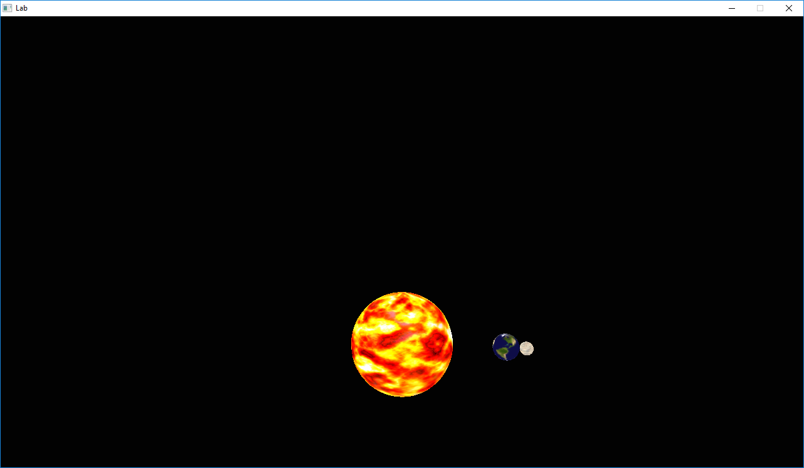

# Assignment 3 - Scenegraph

*TODO*: Please edit the following information in your assignment

* Name and partners name(At most 1 partner for this project!): Erik Gentile
* How many hours did it take you to complete this lab? 7
* Did you collaborate or share ideas with any other students/TAs/Professors?
  No.
* Did you use any external resources?

  * https://webglfundamentals.org/webgl/lessons/webgl-scene-graph.html

* (Optional) What was the most interesting part of the assignment? How would you improve this assignment?

  Being able to create interestingly wonky orbital patterns.

## Description

We have learned how to draw models in the previous assignment using our OBJ files. Additionally, we have learned some abstractions so we can start creating larger graphical scenes with many objects. However, it can quickly become difficult to manage many different objects in on scene, especially when those scenes are large. In order to create larger graphical scenes, a variety of data structures exist that can help us organize our code and make it run more efficiently. For this assignment, we will be focusing implementing a scene graph.

## Scenegraphs

A scenegraph is nothing more than a 'tree' data structure. There is a root of some 'object' at the top, and then every other object that exists is added into a single tree. There may additionally be other 'nodes' in the tree that have meaning in our 3D scene. For example, lighting, a camera, rigid bodies(for physical simulations), or transformations. In our scenegraph, we are only going to have objects (Found in Object.h).

## SceneNode.h

SceneNode.h contains the following methods that have been implemented for you. The majority of this assignment is understanding how to perform a tree traversal and apply transformations from one object successively to the next. In fact, there are only a few lines of code to implement (Less than 5 lines).

## Task 1 - Scene graph

For this assignment you are going to create a solar system.

This involves the following:
- figuring out how to do the scenegraph transformation (stated above).
- Modify SceneNode::Update(...) to make sure transformations are pushed from the parent to the child.
- This algorithm is more efficient than a depth-first-traversal algorithm because the transforms of different
nodes do not have to be calculated more than once. Once parent nodes transforms are calculated, that information is passed to all of its children in order to calculate their transforms.
- Next, create a solar system with at least 3 planets, and 6 moons.
  - Feel free to be creative. You may even modify the shader to get some interesting effects.

  creative != scientifically accurate :)

### How to run your program

*TODO*: You need to include directions on how to run your program here.
(Pretend you are deploying this software to someone who has no idea what your code does and needs to be able to run it. You can assume your user has SDL2 setup however)

1) Compile the project on a linux-based system using the command "python linuxbuild.py" within the assignment folder from a command line.
2) Run the project using the command "./lab"
3) Watch the chaos.

### Deliverables

* You need to commit your code to this repository.
* You need to have a makefile, compile script, visual studio project, or Xcode project and directions on how to run your program. If your program does not compile and run, you get a zero!

### Rubric

* 10% - Do you have directions on how to run your program?
  * (I should be able to download your repository and run very quickly!)
* 80% - Does the scene properly render
* 10% - Polish (Is the code well structured, are there comments, etc.)

## More Resources

Links on Scenegraphs
* (**KEY resource**) https://research.ncl.ac.uk/game/mastersdegree/graphicsforgames/scenegraphs/Tutorial%206%20-%20Scene%20Graphs.pdf
* https://www.panda3d.org/manual/index.php/The_Scene_Graph
* http://www.realityprime.com/blog/2007/06/scenegraphs-past-present-and-future/
* http://what-when-how.com/advanced-methods-in-computer-graphics/scene-graphs-advanced-methods-in-computer-graphics-part-3/
* https://en.wikipedia.org/wiki/Tree_traversal
